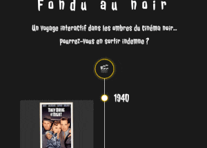

# 🎥 Fondu au noir

Fondu au noir est une application web interactive qui combine une timeline chronologique et un quiz à cartes (flashcards) pour explorer l'histoire du cinéma noir de manière ludique.

## Stack

- React + Vite
- Node.js
- HTML, Typescript
- Vanilla CSS (style et animations "flip")
- Bibliothèques : Framer Motion et Canvas-confetti

## Fonctionnalités

- **Page d'accueil**
- **Page de quiz** avec une Timeline chronologique et des flashcards
  - Flashcards :
  

    
  

  - chaque carte contient un film et une question avec 4 choix de réponse, et se retourne pour révéler la bonne réponse après avoir validé un choix
  - modale "📖 En savoir +" sur le film
  - animation des flashcards avec Framer Motion
  - Compteur de bonnes réponses en temps réel, calcul du score final
- **Page de fin "ScoreBoard"** avec rappel du score final, pourcentage de réussite, historique des derniers scores et une recommandation personnalisée au jouer selon son pourcentage de réussite.
- **Page "Á propos"**
- Responsive Design

### Hooks React utilisés

Ce projet utilise plusieurs hooks React pour gérer l’état global, les effets visuels et la navigation entre les pages.

- `useState` : gestion de l'état des flashcards, du score, et de l'affichage des recommandations.
- `useEffect` : sauvegarde de l'historique des scores dans `localStorage` et déclenchement des confettis à l'arrivée sur la page Scoreboard.
- `useMemo` : calcul du message et de la recommandation selon le score pour éviter des nouveaux calculs.
- `useRef` : gestion de la référence de la modale pour le focus et l'accessibilité, ainsi que pour contrôler les interactions clavier.
- `useNavigate` : gestion de la navigation entre les pages (ex. retour au quiz depuis la page Scoreboard).
- `useCallback` : mémorisation de la fonction de lancement des confettis pour éviter qu’elle ne soit recréée à chaque rendu (optimisation des performances).
- Hooks personnalisés :
  - `useConfetti` : déclenchement des confettis à l'arrivée sur la page Scoreboard. 🎉
  - `useScore` (contexte) : partage et gestion globale du score et des réponses correctes entre les composants.✅

### Images & Icônes

- Canva, favicon.io

## Contact

Si tu souhaites me laisser un commentaire, un retour ou poser une question sur le projet, tu peux utiliser les **Issues** de ce dépôt GitHub :  
[💬 Ouvrir une Issue](https://github.com/EvaTP/fondu-au-noir/issues)

> Explique ton commentaire ou ta suggestion dans l’issue, et je te répondrai dès que possible.
